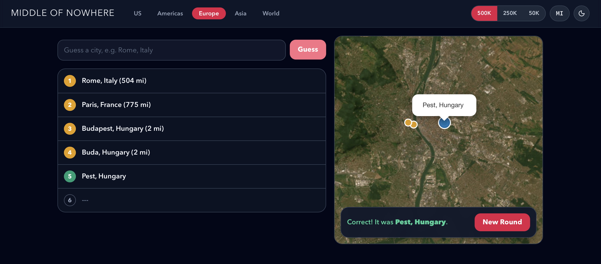

# Middle of Nowhere

[](https://github.com/sebseager/middle-of-nowhere/actions/workflows/deploy-pages.yml)
[](https://github.com/sebseager/middle-of-nowhere/actions/workflows/test.yml)

A geography guessing game built with React, TypeScript, Vite, and Leaflet.



## Getting Started

### Install

```bash
npm ci
```

### Run Locally

```bash
npm run dev
```

### Build

```bash
npm run build
```

### Type Check

```bash
npm run check
```

### Test

```bash
npm test -- --ci --runInBand
```

## Contributing

See [CONTRIBUTING.md](CONTRIBUTING.md) for development workflow and pull request guidelines.

## License

Available under the [MIT license](LICENSE).
